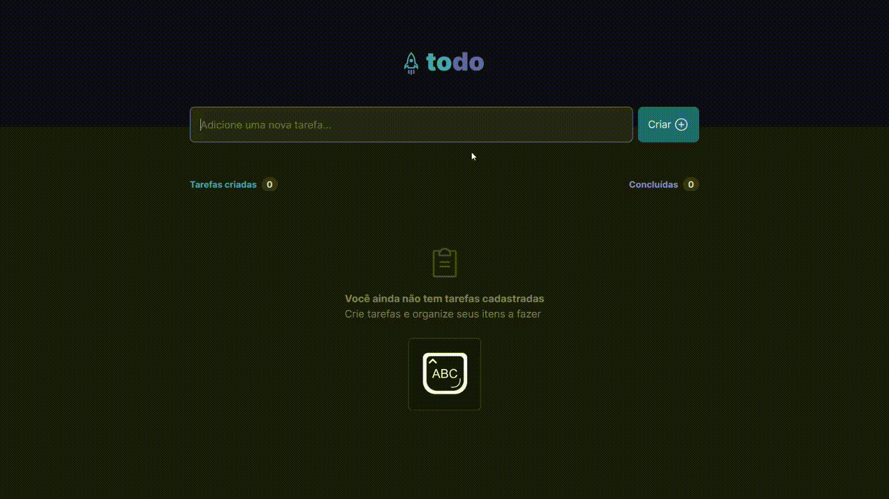
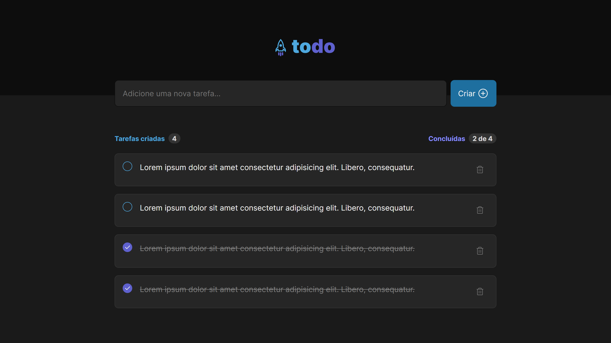
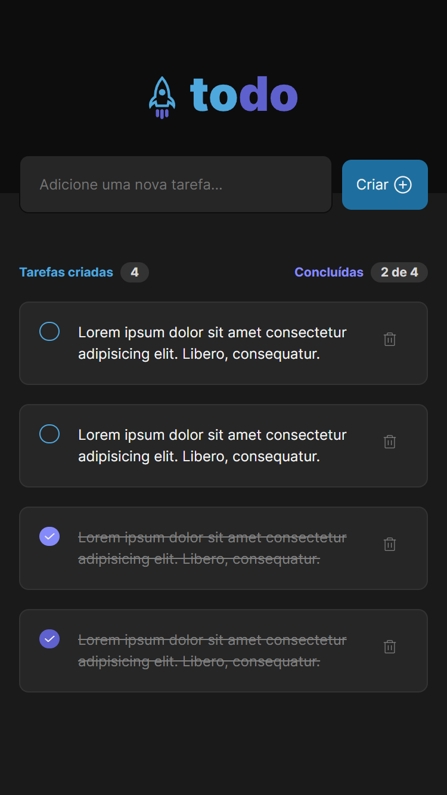
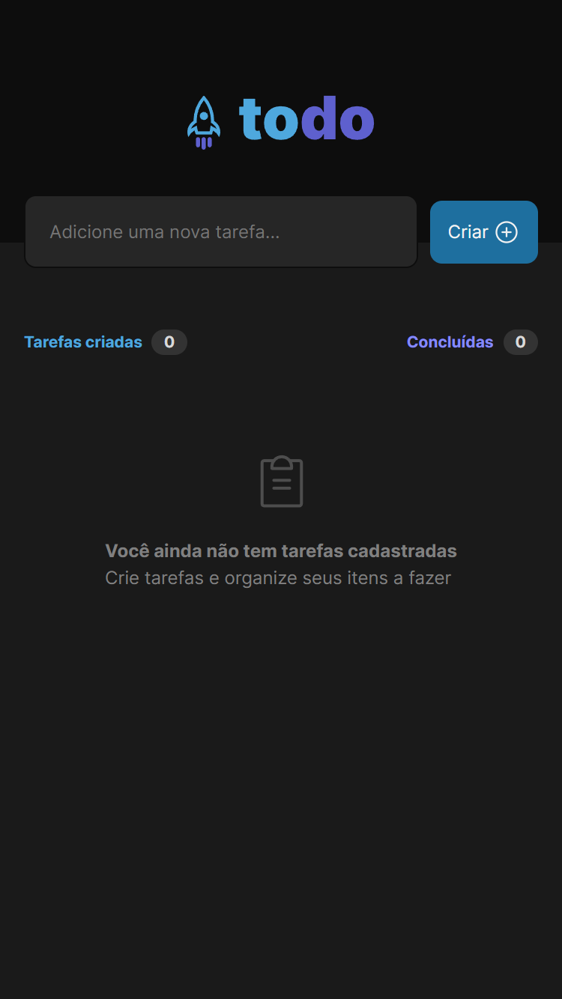

<p align="center">
  
</p>

<p align="center">
    <strong>Todo List.</strong>
</p>

<p align="center">
 <a href="#-about-the-project">About</a> •
 <a href="#-feats">Feats</a> • 
 <a href="#-layout">Layout</a> • 
 <a href="#-technologies">Technologies</a> • 
 <a href="#-setup">Setup</a> • 
 <a href="#-license">License</a>
</p>

<h4 align="center"> 
	🚧 Completed project 🚧
</h4>

## 💻 About the project

Simple todo list web app to save and manage tasks.

<p align="center">
  
</p>


## ☑ Feats

- [x] Insert tasks
  - [x] Insert with enter
  - [x] Empty field check
- [x] Change task state
  - [x] Mark as done
  - [x] Delete task
- [x] Responsive design


## 🎨 Layout

### Desktop

<p align="left"> 
  
</p>

### Mobile

<p align="left">       
  
  
</p>

## 🔨 Built With

The following technologies were used to build this project:

- **[ReactJS](https://reactjs.org/)**
- **[Vite](https://vitejs.dev/)**
- **[TypeScript](https://www.typescriptlang.org/)**
- **[TailwindCSS](https://tailwindcss.com/)**

## 🚀 Setup

```bash
# Clone the repository
git clone https://github.com/manoel-lopes/todo-list-app.git

# Access the project folder
cd todo-list-app

# Install the dependencies
npm install

# Run the application
npm run dev

# The server will start on port:3000 - go to http://localhost:3000
```


## 📝 License

This project is under MIT license.

---

Develope with 💜 by [Manoel Lopes](https://github.com/manoel-lopes)
